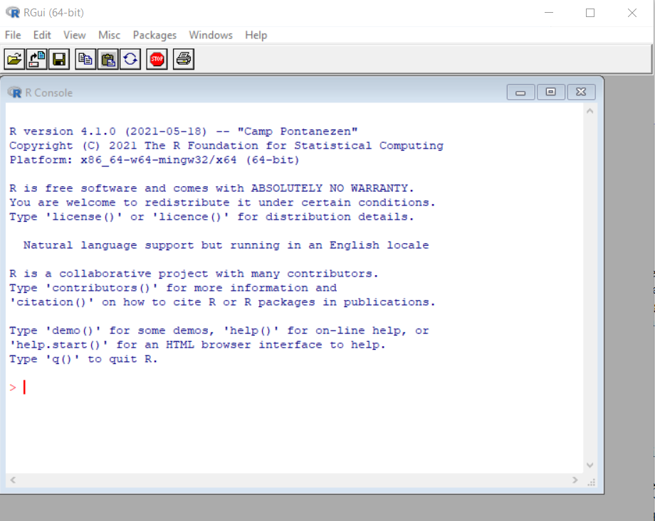
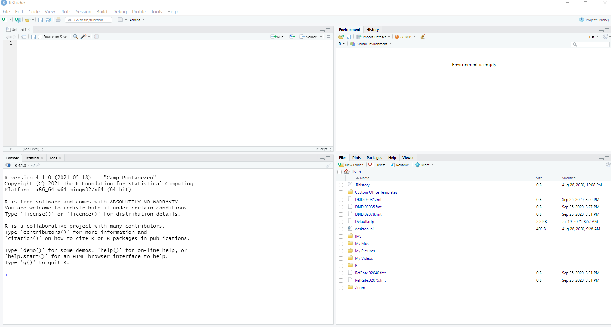
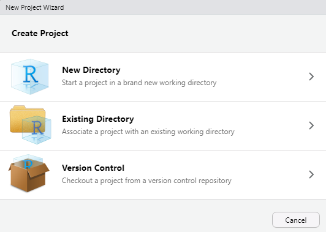

class: inverse, center, middle
# Using R and RStudio


---
# Open R and take a look

The R Graphical User Interface (RGui) will contain a window labeled R Console. You can type code directly into the console and get results.

<p align="center">


---
# Open R and take a look

Demonstrate how to:

- Assign values to an object
- Perform a function on that object
- Plot


---
# Open RStudio and take a look

<p align="center">


---
# Open RStudio and take a look

Demonstrate how to:

- Create a new R script
- Add some code to it
- Run the code
- View help files
- Save the R Script


---
# RStudio Tips

- Always save your R Script code

  - Go to File > New File > R script to open a new R Script
  - Go to File > Save to save it somewhere memorable with a useful name

- There are several ways to run code: 

  1. Place your cursor next to the line you want to run and hit Ctrl(Cmd)+Enter on your keyboard
  2. Place your cursor next to the line you want to run and hit the "Run" button
  3. Highlight multiple lines of code and use one of the previous options

- Get help by typing `?fnname` where `fnname` is the name of the function of interest
  
  - e.g. to see the help file for the mean function, type `?mean`
  - Using `??fnname` can be used if you aren't sure of the exact function name and will return any keyword matches


---
# Loading data

The most common data format we work with is **Excel**. 

How to format data to load into R:

1. One dataset at a time
2. Include a single row of column headers
3. Use simple column headers - these will be transformed into variable names by R
4. Usually one row per patient/sample, exceptions are repeated measures


---
# Loading data

**Approach #1**:

Use the {readxl} package. 

First install the package from CRAN using `install.packages()`. 
    
```{r eval = FALSE}
install.packages("readxl")
```

Then load the newly installed package with a call to `library()`.
  
```{r eval = FALSE}
library(readxl)
```
  
And finally use the `read_excel()` function with the appropriate file path to read in the data and save it as an object called "mydf".
  
```{r eval = FALSE}
mydf <- read_excel("H:/MMED/intro-to-r-rstudio/rstudio-demo/data/StatsDataSet-2A.xlsx")
```
    
(Note: R treats the \\ as a special character so you either need to use / or \\\ in file paths)


---
# Side note: installing R packages

**From CRAN**:

```{r eval = FALSE}
install.packages("readxl")
```


---
# Side note: installing R packages

**From GitHub**. 

First, you need to install the {remotes} package from CRAN:
    
```{r eval = FALSE}
install.packages("remotes")
```

Then you can load the GitHub package of interest using `install_github("username/repository")`. For example, to load the {ezfun} package from my GitHub account at username "zabore":

```{r eval = FALSE}
library(remotes)
install_github("zabore/ezfun")
```

Or, you can avoid a call to `library()` if you only plan to use a library once or want to avoid conflicts by using `library::function()`:

```{r eval = FALSE}
remotes::install_github("zabore/ezfun")
```


---
# Side note: installing R packages
    
**From Bioconductor**. 

First, install the {BiocManager} package from CRAN:

```{r eval = FALSE}
install.packages("BiocManager")
```

Then install, for example, the {GenomicFeatures} package using the `install` function:

```{r eval = FALSE}
BiocManager::install("GenomicFeatures")
```


---
# Side note: installing R packages

- Installation is the first step. 
- Once you have installed the package, you need to load it into your current R session for use. 
- Only packages that have been loaded will be available in any given R session, and this needs to be done each time you start a fresh R session.

Two methods:

A call to `library()` loads the package for your entire R session.

```{r eval = FALSE}
library(readxl)
```

Using `::` accesses the package only for a single function. Functions from the package will not be available for later use in your R session.

```{r eval = FALSE}
readxl::read_excel("Myfilename")
```


---
# Loading data

**Approach #2**:
    
Save the file as .csv and read in with base R

Advantages: removes some of the possible formatting pitfalls associated with Excel files, and you don't need any special packages to read this format.

First, open the Excel file.
    
Go to File > Save As and select "CSV (Comma delimited)" from the "Save as type" drop down.
    
Then use the `read.csv()` function with the appropriate file path to read in the data and save it as an object called "mydf2".
    
```{r eval = FALSE}
mydf2 <- read.csv("H:/MMED/intro-to-r-rstudio/rstudio-demo/data/StatsDataSet-2A.csv")
```


---
# Loading data

Demonstrate how to:

- Load data with the previously detailed two approaches
- See what datasets are loaded in your R session
- View the data in the Viewer
- View the data in the Console


---
# Loading data

It's possible to load many other file types as well. Some included options:

- `read.table()` is the most generic function and can read many file types
- `read.csv()` is a special case with fixed defaults for comma-separated files
- `read.csv2()` is a special case with fixed defaults for comma-separated files that were created in a country where commas are used in place of decimal places
- `read.delim()` is a special case with fixed defaults for tab-delimited files
- `read.delim2()` is a special case with fixed defaults for tab-delimited files that were created in a country where commas are used in place of decimal places

An internet search will turn up many available options to load more specialized file types or data structures.


---
# R projects

- Put all the files related to a single project (e.g. data, code, figures, notes, etc) in a designated folder. 
- Okay to use subfolders as desired
- Go to File > New Project...

<p align="center">


---
# R projects

Demonstrate how to:

- Create a new R project
- See what project is active
- Close the project


---
# R projects

- Now all file paths will be relative to the location of the R project. So you can simply use:

  ```{r eval = FALSE}
  mydf2 <- read.csv("rstudio-demo/data/StatsDataSet-2A.csv")
  ```

- You can move the project folder to a different location on your computer, or to a different computer entirely, and your file paths should still work as long as you are working in the project.
- Can open multiple sessions of RStudio using projects so that you can work on two (or more) projects simultaneously.
- Every time you open the project, you get a fresh RStudio session.


---
# The {here} package

```{r eval = FALSE}
install.packages("here")
library(here)
```

- Makes it easy to reference subfolders in your main project folder
- No need to worry about the \\ issue
- Code will work even outside of the project
- Writes paths safely across operating systems so code is more reproducible

To use the {here} package, simply use the function `here` and mention the filename of interest, or place any subfolders ahead of the filename separated by commas, so that "rstudio-demo/data/StatsDataSet-2A.csv" becomes:

```{r eval = FALSE}
mydf2 <- read.csv(here("rstudio-demo", "data", "StatsDataSet-2A.csv"))
```